# Escape Crystal Notify
Provides an all-in-one suite for managing your Escape Crystal in Old School Runescape. 

Useful for HCIM/HCGIM

# Features
- Scalable reminder image display
- Info Box Display
- Inventory & equipment screen highlighting and info
- All display types support countdown to teleport and/or current setting (in either ticks or seconds)
- Configurable location based filtering to only notify you in locations that are a dangerous death for your account type
- Configurable notifications to remind you when:
  - You are missing an escape crystal
  - Carrying an inactive escape crystal
  - Close to triggering the inactivity teleport
  - Do not have your escape crystal set to left-click teleport

# In Game View - Inventory Highlighting
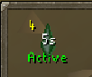 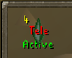 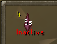 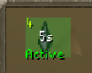 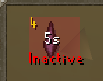

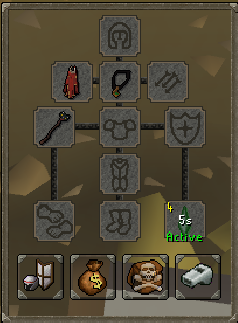 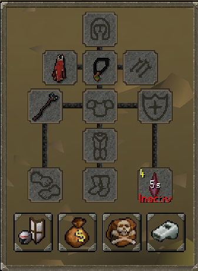

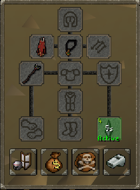 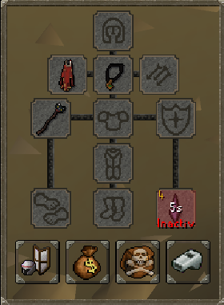

# In Game View - On-Screen Widget
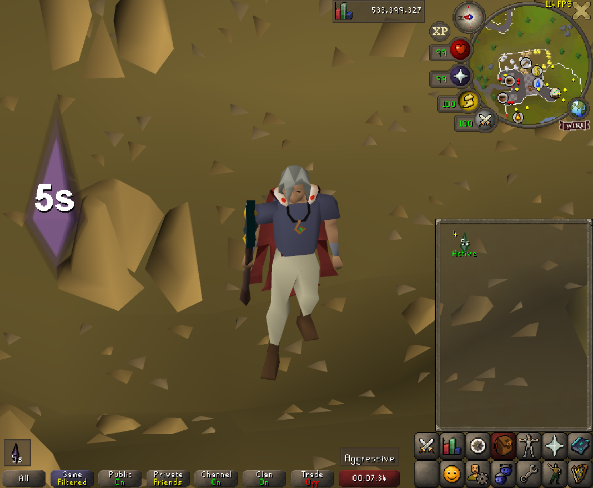 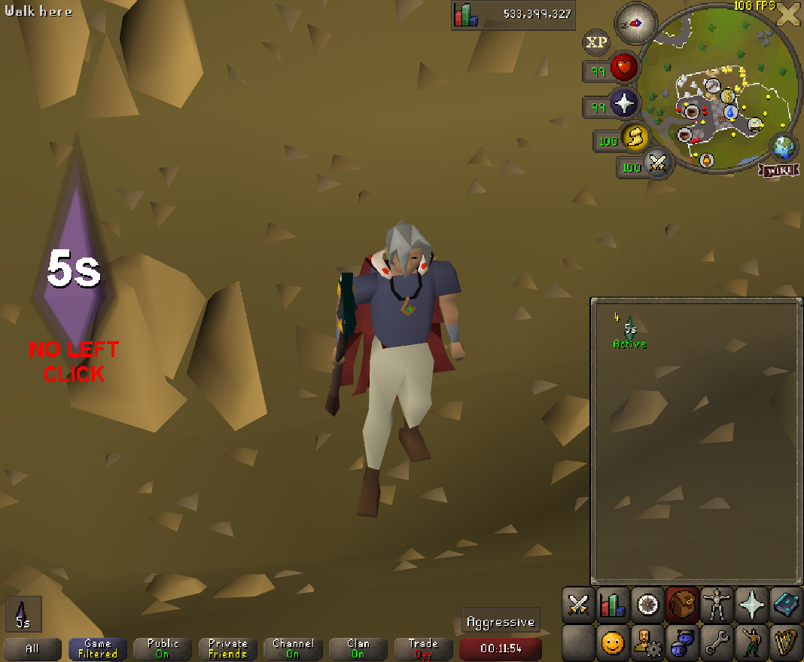 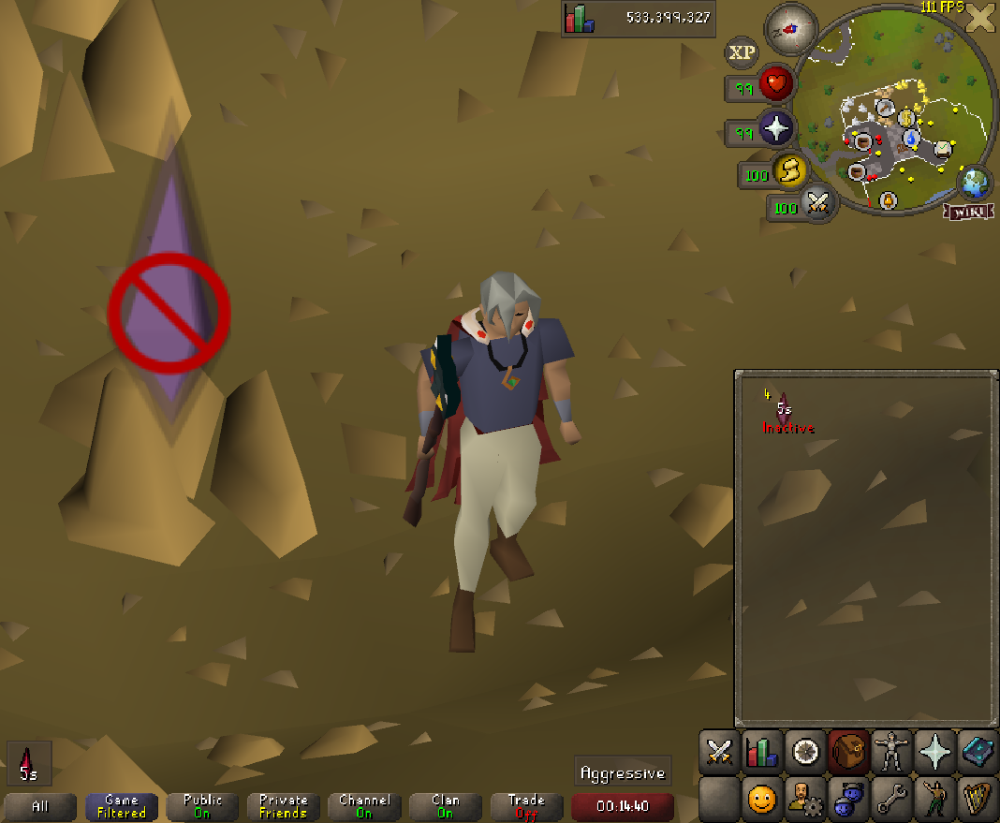

# In Game View - Info Box
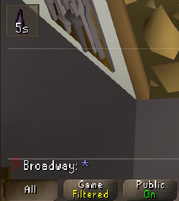 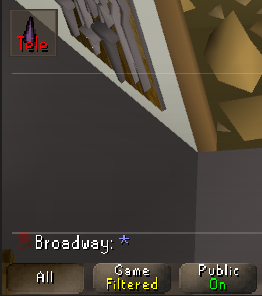 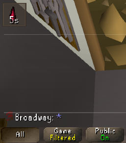 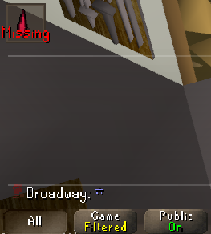

# Configuration
