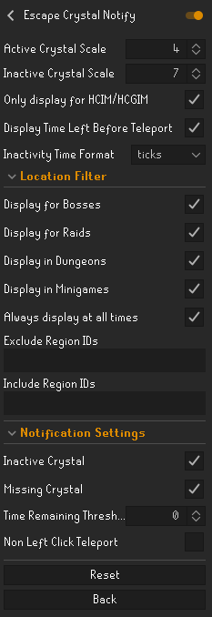
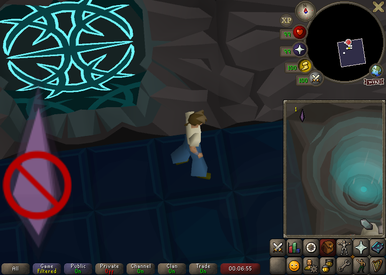
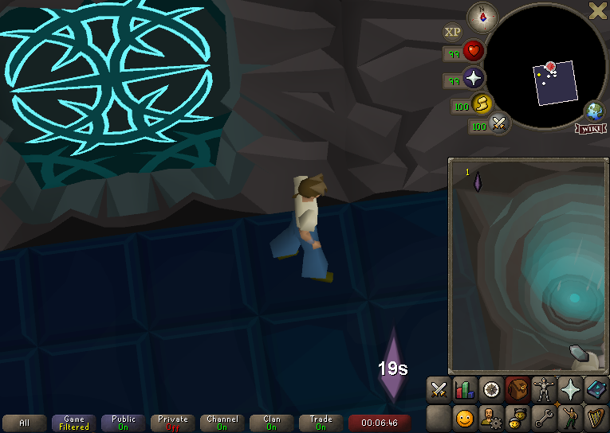
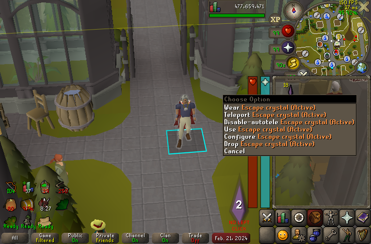

# Escape Crystal Notify
Notifies you when you're not wearing an escape crystal, have an inactive escape crystal, or are close to triggering the escape crystal. Useful for HCIM/HCGIM.

# Features
- Scalable reminder image display
- Scalable countdown to teleport image display (in either ticks or seconds)
- Configurable location based filtering to only notify you in locations that are a dangerous death for your account type
- Configurable notifications to remind you when missing an escape crystal, carrying an inactive escape crystal, or close to triggering the inactivity teleport

# Configuration

# In Game View - Inactive

# In Game View - Active

# In Game View - Active But Left Click Teleport Disabled

