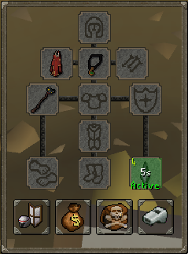
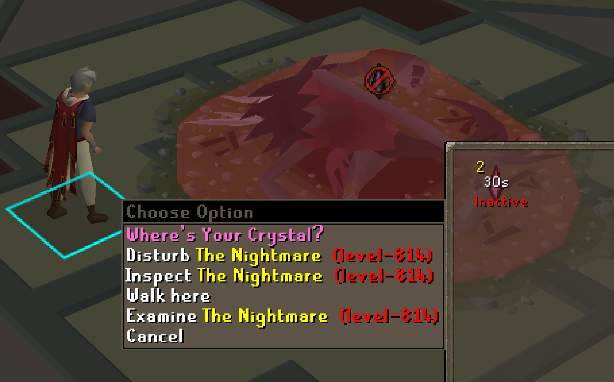

# Escape Crystal Notify
Provides an all-in-one suite for managing your Escape Crystal in Old School Runescape. 

Useful for HCIM/HCGIM

# Features
- Scalable reminder image display
- Info Box Display
- Inventory & equipment screen highlighting and info
- Boss entrance highlight and overlay reminder
- Deprioritized left-click entry on boss entrances when an Escape Crystal is not active (Wilderness bosses are always left-click entry)
- All display types support countdown to teleport and/or current setting (in either ticks or seconds)
- Configurable location based filtering to only notify you in locations that are a dangerous death for your account type
- Configurable notifications to remind you when:
  - You are missing an escape crystal
  - Carrying an inactive escape crystal
  - Close to triggering the inactivity teleport
  - Do not have your escape crystal set to left-click teleport
- Minimal inventory highlighting for non-HC accounts
- Safeguards to prevent deaths due to Leviathan's logout bug
  - Option to disable left-click logouts while inside of Leviathan's arena
  - Warning message when approaching a 6-hour logout while at Leviathan's entry boat
- Safeguards to prevent deaths due to Doom's logout bug
  - Option to disable left-click logouts while inside of Doom's arena
  - Warning message when approaching a 6-hour logout while at Doom's entry boat
  - Logout is re-enabled between levels

# In Game View - Inventory Highlighting
    

 

 

# In Game View - Entrance Highlighting and Enter Option Deprioritization

# In Game View - On-Screen Widget
  

# In Game View - Info Box
   

# In Game View - Logout Safeguard Panels
 

 

# In Game View - Minimal Non-HC Inventory Highlight
 

# Configuration

 